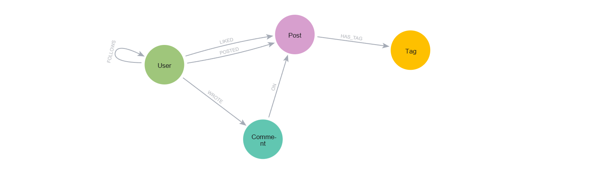

# Social Graph Insights com Neo4j

## 1. Contexto do problema

Uma startup de análise de mídias sociais deseja criar um produto capaz de analisar conexões, interações e engajamento entre usuários. O objetivo é usar um banco de dados de grafos para responder perguntas como:

* Quem um usuário deveria seguir?
* Quais posts deveriam aparecer no feed?
* Quais posts são mais relevantes para determinado usuário?
* Quais usuários são mais influentes?
* Quais comunidades de interesse existem na rede?

A escolha por grafos faz sentido porque redes sociais são naturalmente compostas por **entidades conectadas**: usuários seguem usuários, usuários publicam posts, posts possuem tags, usuários curtem, comentam e compartilham conteúdos. O Neo4j é adequado para esse cenário porque trabalha diretamente com nós e relacionamentos, evitando consultas muito pesadas baseadas em várias junções relacionais.

---

## 2. Modelo do grafo



### Labels principais

| Label       | Descrição                       | Propriedades principais               |
| ----------- | ------------------------------- | ------------------------------------- |
| `User`      | Usuário da rede social          | `id`, `username`, `name`, `createdAt` |
| `Post`      | Publicação feita por um usuário | `id`, `content`, `createdAt`          |
| `Comment`   | Comentário feito em um post     | `id`, `text`, `createdAt`             |
| `Tag`       | Tema ou assunto do post         | `name`                                |
<!-- Community label removed: not used in this prototype -->

### Relacionamentos principais

| Relacionamento | Origem → Destino   | Descrição                        | Propriedades |
| -------------- | ------------------ | -------------------------------- | ------------ |
| `FOLLOWS`      | `User → User`      | Usuário segue outro usuário      | `since`      |
| `POSTED`       | `User → Post`      | Usuário publicou um post         | —            |
| `LIKED`        | `User → Post`      | Usuário curtiu um post           | `at`         |
| `SHARED`       | `User → Post`      | Usuário compartilhou um post     | `at`         |
| `WROTE`        | `User → Comment`   | Usuário escreveu comentário      | —            |
| `ON`           | `Comment → Post`   | Comentário pertence a um post    | —            |
| `HAS_TAG`      | `Post → Tag`       | Post possui tag/tema             | —            |
<!-- Community relationships removed: not used in this prototype -->

### Representação simplificada

```
(User)-[:FOLLOWS]->(User)

(User)-[:POSTED]->(Post)
(User)-[:LIKED]->(Post)
(User)-[:SHARED]->(Post)

(User)-[:WROTE]->(Comment)-[:ON]->(Post)

(Post)-[:HAS_TAG]->(Tag)

(no community nodes in this simplified model)
```

---

## 3. Estrutura do repositório

```
social-graph-insights/
│
├── README.md
│
├── data/
│   ├── users.csv
│   ├── posts.csv
│   ├── follows.csv
│   ├── likes.csv
│   ├── comments.csv
│   └── post_tags.csv
│
├── cypher/
│   ├── 01_constraints.cypher
│   ├── 02_load_data.cypher
│   ├── 03_business_queries.cypher
│   └── 04_cleanup.cypher
│
└── docs/
    └── troubleshooting.md
```

---

## 4. Constraints e índices

Antes de carregar os dados, crie constraints para evitar duplicidade. O Neo4j permite criar constraints com `IF NOT EXISTS`, evitando erro caso elas já tenham sido criadas.

Para executar, abra o Neo4j Browser e cole o conteúdo de `cypher/01_constraints.cypher`:

```cypher
CREATE CONSTRAINT user_id_unique IF NOT EXISTS
FOR (u:User)
REQUIRE u.id IS UNIQUE;

CREATE CONSTRAINT post_id_unique IF NOT EXISTS
FOR (p:Post)
REQUIRE p.id IS UNIQUE;

CREATE CONSTRAINT comment_id_unique IF NOT EXISTS
FOR (c:Comment)
REQUIRE c.id IS UNIQUE;

CREATE CONSTRAINT tag_name_unique IF NOT EXISTS
FOR (t:Tag)
REQUIRE t.name IS UNIQUE;

CREATE INDEX post_created_at IF NOT EXISTS
FOR (p:Post)
ON (p.createdAt);

CREATE INDEX user_username IF NOT EXISTS
FOR (u:User)
ON (u.username);
```

---

## 5. Dataset de exemplo

Veja os arquivos `CSV` na pasta a seguir:

```
data/
├── users.csv
├── posts.csv
├── follows.csv
├── likes.csv
├── comments.csv
└── post_tags.csv
```

---

## 6. Como executar

### Passo 1: Configurar o Neo4j

1. Instale o [Neo4j Community Edition](https://neo4j.com/download/)
2. Inicie o banco de dados
3. Acesse o Neo4j Browser em `http://localhost:7687`

### Passo 2: Carregar os dados (duas opções)

Você tem duas maneiras de popular o banco:

- **Opção recomendada — Inline (sem CSV)**: rode o script `cypher/02_load_data_inline.cypher` no Neo4j Browser. Esse script insere os nós e relacionamentos diretamente (recomendado quando não quiser configurar o import CSV).

- **Opção alternativa — Usando CSVs (se preferir)**: copie os arquivos da pasta `data/` para a pasta `import` do Neo4j e execute `cypher/02_load_data.cypher`.

Como copiar os CSVs para a pasta `import`:

```bash
# Linux/Mac
cp data/*.csv ~/.neo4j/import/

# Windows (PowerShell)
Copy-Item -Path data\\*.csv -Destination $env:USERPROFILE\\.neo4j\\import -Force
```

Se estiver usando Docker, copie para o container:

```bash
docker cp data/users.csv <container-name>:/var/lib/neo4j/import/
docker cp data/posts.csv <container-name>:/var/lib/neo4j/import/
# ... e assim por diante
```

**Importante (CSV):** o Neo4j pode bloquear `file:///` por segurança. Se receber o erro `dbms.security.allow_csv_import_from_file_urls is false`, habilite em `neo4j.conf`:

```
dbms.security.allow_csv_import_from_file_urls=true
```

### Passo 3: Executar os scripts (ordem recomendada)

No Neo4j Browser execute, na ordem:

1. **Criar constraints**: cole e execute `cypher/01_constraints.cypher`
2. **Carregar dados**:
  - Recomendo: execute `cypher/02_load_data_inline.cypher` (insere dados inline)
  - Alternativa: execute `cypher/02_load_data.cypher` se preferir importar CSVs (veja nota acima sobre `dbms.security`)
3. **Visualizar o schema**: execute `CALL db.schema.visualization();`

---

## 8. Queries de negócio

### Consulta 1 — Indicação de amizades

**Pergunta:** quais usuários Paulo deveria seguir com base em conexões em comum?

```cypher
MATCH (me:User {username: 'paulo'})
MATCH (me)-[:FOLLOWS]->(friend:User)-[:FOLLOWS]->(candidate:User)
WHERE candidate <> me
  AND NOT (me)-[:FOLLOWS]->(candidate)

WITH me, candidate, collect(DISTINCT friend.username) AS mutualFriends

OPTIONAL MATCH (me)-[:LIKED]->(:Post)-[:HAS_TAG]->(tag:Tag)<-[:HAS_TAG]-(:Post)<-[:POSTED]-(candidate)

RETURN candidate.username AS suggestedUser,
       candidate.name AS name,
       mutualFriends,
       size(mutualFriends) AS mutualFriendsCount,
       count(DISTINCT tag) AS commonInterests,
       size(mutualFriends) * 2 + count(DISTINCT tag) AS recommendationScore
ORDER BY recommendationScore DESC;
```

**Resultado esperado:**
- Lista de usuários recomendados
- Amigos em comum
- Interesses em comum
- Score de recomendação baseado em amigos + interesses

---

### Consulta 2 — Feed baseado em quem o usuário segue

**Pergunta:** quais posts devem aparecer no feed de Paulo?

```cypher
MATCH (me:User {username: 'paulo'})
MATCH (me)-[:FOLLOWS]->(author:User)-[:POSTED]->(post:Post)

OPTIONAL MATCH (post)<-[like:LIKED]-(:User)
WITH me, author, post, count(DISTINCT like) AS likes

OPTIONAL MATCH (post)<-[:ON]-(comment:Comment)
WITH author, post, likes, count(DISTINCT comment) AS comments

RETURN author.username AS author,
       post.content AS content,
       post.createdAt AS createdAt,
       likes,
       comments,
       likes * 3 + comments * 2 AS engagementScore
ORDER BY engagementScore DESC, createdAt DESC;
```

**Resultado esperado:**
- Posts dos usuários seguidos
- Ordenados por engajamento (curtidas + comentários)
- Mostra data de criação para contexto temporal

---

### Consulta 3 — Recomendação de posts com base no que o usuário curtiu

**Pergunta:** quais posts Paulo pode gostar, mesmo que não siga o autor?

```cypher
MATCH (me:User {username: 'paulo'})
MATCH (me)-[:LIKED]->(:Post)-[:HAS_TAG]->(tag:Tag)
MATCH (tag)<-[:HAS_TAG]-(recommendedPost:Post)<-[:POSTED]-(author:User)

WHERE NOT (me)-[:LIKED]->(recommendedPost)
  AND NOT (me)-[:POSTED]->(recommendedPost)

OPTIONAL MATCH (recommendedPost)<-[like:LIKED]-(:User)
WITH recommendedPost, author, collect(DISTINCT tag.name) AS matchedTags, count(DISTINCT like) AS likes

RETURN recommendedPost.content AS post,
       author.username AS author,
       matchedTags,
       size(matchedTags) AS interestScore,
       likes AS popularityScore,
       size(matchedTags) * 5 + likes AS finalScore
ORDER BY finalScore DESC;
```

**Resultado esperado:**
- Posts baseados em tags que o usuário interagiu
- Score baseado em relevância (tags em comum) e popularidade
- Demonstra o poder do grafo para recomendações indiretas

---

### Consulta 4 — Posts mais populares da rede

**Pergunta:** quais posts possuem maior engajamento?

```cypher
MATCH (post:Post)<-[:POSTED]-(author:User)

OPTIONAL MATCH (post)<-[like:LIKED]-(:User)
WITH post, author, count(DISTINCT like) AS likes

OPTIONAL MATCH (post)<-[:ON]-(comment:Comment)
WITH post, author, likes, count(DISTINCT comment) AS comments

RETURN post.content AS post,
       author.username AS author,
       likes,
       comments,
       likes * 1 + comments * 2 AS engagementScore
ORDER BY engagementScore DESC;
```

---

### Consulta 5 — Usuários mais influentes

**Pergunta:** quais usuários têm maior influência na rede?

```cypher
MATCH (u:User)

OPTIONAL MATCH (follower:User)-[:FOLLOWS]->(u)
WITH u, count(DISTINCT follower) AS followers

OPTIONAL MATCH (u)-[:POSTED]->(post:Post)<-[like:LIKED]-(:User)
WITH u, followers, count(DISTINCT like) AS totalLikesReceived

OPTIONAL MATCH (u)-[:POSTED]->(post:Post)<-[:ON]-(comment:Comment)
WITH u, followers, totalLikesReceived, count(DISTINCT comment) AS totalCommentsReceived

RETURN u.username AS username,
       u.name AS name,
       followers,
       totalLikesReceived,
       totalCommentsReceived,
       followers * 3 + totalLikesReceived * 2 + totalCommentsReceived AS influenceScore
ORDER BY influenceScore DESC;
```

---

### Consulta 6 — Comunidades de interesse por tags

**Pergunta:** quais temas concentram mais usuários engajados?

```cypher
MATCH (u:User)-[:LIKED]->(:Post)-[:HAS_TAG]->(tag:Tag)

RETURN tag.name AS interest,
       count(DISTINCT u) AS engagedUsers,
       collect(DISTINCT u.username)[0..5] AS sampleUsers
ORDER BY engagedUsers DESC;
```

---

### Consulta 7 — Usuários com interesses parecidos

**Pergunta:** quais usuários têm interesses parecidos com Paulo?

```cypher
MATCH (me:User {username: 'paulo'})
MATCH (me)-[:LIKED]->(:Post)-[:HAS_TAG]->(tag:Tag)
MATCH (other:User)-[:LIKED]->(:Post)-[:HAS_TAG]->(tag)

WHERE other <> me

RETURN other.username AS similarUser,
       other.name AS name,
       collect(DISTINCT tag.name) AS commonTags,
       count(DISTINCT tag) AS similarityScore
ORDER BY similarityScore DESC;
```

---

## 9. Tecnologias utilizadas

- **Neo4j** — banco de dados de grafos
- **Cypher** — linguagem de query do Neo4j
- **CSV** — formato de dados de entrada

---

## Referências

- [Neo4j Community Edition](https://neo4j.com/download/)
- [Neo4j Cypher Manual](https://neo4j.com/docs/cypher-manual/current/)
- [Neo4j Graph Database Concepts](https://neo4j.com/product/community-edition/)
- [Neo4j Data Visualization](https://neo4j.com/docs/visualize/)
